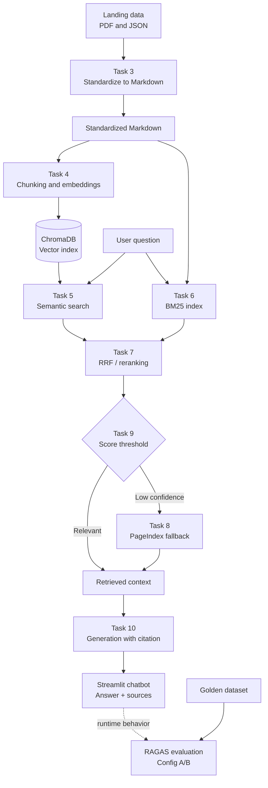

# University Services RAG Chatbot

## 1. Mục tiêu

Xây dựng chatbot RAG trả lời câu hỏi về dịch vụ và chính sách đại học dựa trên tài liệu RMIT Vietnam. Hệ thống gồm hai phần:

- Chatbot Streamlit có citation, conversation memory và hiển thị nguồn.
- Pipeline đánh giá RAGAS với golden dataset và so sánh A/B.

## 2. Tính năng

- Hybrid retrieval: semantic search + BM25 lexical search.
- Hai chế độ trên giao diện: `Hybrid + Rerank` và `Hybrid không Rerank`.
- RRF/reranking và PageIndex vectorless fallback.
- Generation bằng OpenRouter/OpenAI-compatible API.
- Citation và danh sách source chunks.
- Follow-up questions với conversation memory.
- Đánh giá bằng Faithfulness, Answer Relevancy, Context Recall và Context Precision.

## 3. Kiến trúc



### Luồng xử lý chính

1. Dữ liệu PDF/JSON trong `data/landing/` được Task 3 chuyển thành Markdown.
2. Task 4 chia tài liệu thành chunks, tạo embeddings và lưu vào ChromaDB.
3. Task 5 tìm kiếm semantic, còn Task 6 tìm kiếm lexical bằng BM25.
4. Task 7 hợp nhất và rerank kết quả; Task 9 điều phối toàn bộ retrieval.
5. Nếu kết quả semantic có điểm thấp, Task 8 được dùng làm vectorless fallback.
6. Task 10 đưa context vào LLM, yêu cầu câu trả lời grounded kèm citation.
7. `app.py` hiển thị câu trả lời, lịch sử hội thoại và source documents.

## 4. Thành viên và phân công

| Thành viên | MSSV | Vai trò | Nhiệm vụ | Trạng thái |
|---|---|---|---|---|
| Đào Quốc Đại | 2A202601285 | Role 1 – Team Leader & RAG Architect | Điều phối, kiến trúc pipeline và tích hợp tổng thể | |
| Minh | 2A202601955 | Role 2 – Data & Pipeline Specialist | Thu thập, chuẩn hóa dữ liệu và xây dựng index | |
| Nguyễn Đức Trọng | 2A202601291 | Role 3 – Frontend & Chatbot Developer | Xây dựng Streamlit UI và kết nối generation | |
| Đặng Trần Trung Dũng | 2A202601785 | Role 4 – Retrieval & Search Engineer | Semantic search, BM25, reranking và fallback | |
| Trần Hà Bảo Long | 2A202601189 | Role 5 – Evaluation & QA Engineer | Golden dataset, test, RAGAS evaluation và báo cáo | |

## 5. Cài đặt

Yêu cầu Python 3.11 hoặc tương thích và môi trường ảo/Conda riêng cho repo.

```cmd
python -m pip install -r requirements.txt
```

Tạo file `.env` từ `.env.example` và cấu hình tối thiểu:

```env
OPENROUTER_API_KEY=your_key_here
EMBEDDING_PROVIDER=openrouter
OPENROUTER_EMBEDDING_MODEL=openai/text-embedding-3-small
LLM_MAX_TOKENS=512
```

Có thể dùng embedding local bằng cách đặt `EMBEDDING_PROVIDER=local` và cấu hình `LOCAL_EMBEDDING_MODEL`.

## 6. Chuẩn hóa dữ liệu và tạo index

Sau khi cập nhật dữ liệu trong `data/landing/`, chạy:

```cmd
python -m src.task3_convert_markdown
python -m src.task4_chunking_indexing
```

Task 4 tạo ChromaDB tại `chroma_db/`. Khi thay đổi tài liệu hoặc embedding provider, cần chạy lại Task 4.

## 7. Chạy chatbot

```cmd
python -m streamlit run app.py
```

Trong sidebar, người dùng có thể:

- Chọn số lượng chunks `top_k`.
- Chọn `Hybrid + Rerank` hoặc `Hybrid không Rerank`.
- Chọn câu hỏi gợi ý.

Trong thời gian model xử lý, ô chat và các nút gợi ý được khóa. Mỗi câu trả lời hiển thị các source documents đã sử dụng.

## 8. Kiểm thử

```cmd
python -m pytest tests/test_individual.py -v
```

Kết quả hoàn thành mục tiêu cá nhân là toàn bộ test Task 1–10 đều passed. Các test cần OpenRouter phải được chạy trong môi trường có network, API key hợp lệ và đủ quota.

## 9. Đánh giá RAGAS

Golden dataset nằm tại `group_project/evaluation/golden_dataset.json` và gồm tối thiểu 15 câu hỏi cùng expected answer/context.

Chạy evaluation:

```cmd
python -m group_project.evaluation.eval_pipeline
```

Kết quả runtime được ghi vào:

```text
group_project/evaluation/results.json
```

File báo cáo trình bày được duy trì riêng:

```text
group_project/evaluation/results.md
```

Evaluation so sánh hai cấu hình:

- Config A: hybrid retrieval có reranking.
- Config B: hybrid retrieval không reranking.

Các metric gồm Faithfulness, Answer Relevancy, Context Recall và Context Precision. Không được thay thế giá trị thiếu hoặc lỗi provider bằng số giả; cần ghi rõ trong báo cáo nếu một case không đo được.

## 10. Checklist bàn giao

- [ ] Điền bảng thành viên và phân công.
- [ ] Kiểm tra dữ liệu trong `data/landing/` và `data/standardized/`.
- [ ] Tạo/cập nhật `chroma_db/` sau lần thay đổi dữ liệu cuối.
- [ ] Chạy test Task 1–10 và lưu transcript kết quả.
- [ ] Chạy Streamlit và kiểm tra câu trả lời, citation, source và follow-up.
- [ ] Chạy evaluation trên toàn bộ golden dataset.
- [ ] Kiểm tra `results.json` có đủ hai config và các metric.
- [ ] Hoàn thiện `results.md` với bảng điểm, worst performers và phân tích A/B.
- [ ] Kiểm tra `.env` không được commit lên repository.
- [ ] Commit và push các thay đổi lên branch của team.

## 11. Giới hạn hiện tại

Chatbot chỉ trả lời những nội dung có bằng chứng trong tài liệu đã index. Nếu tài liệu không chứa thông tin cụ thể, hệ thống sẽ trả lời rằng chưa thể xác minh thay vì tự suy đoán.
